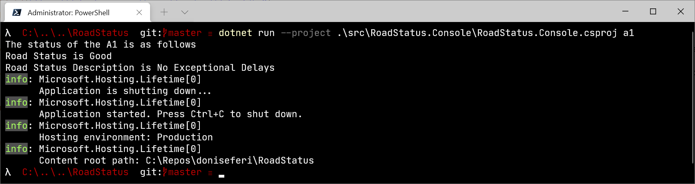
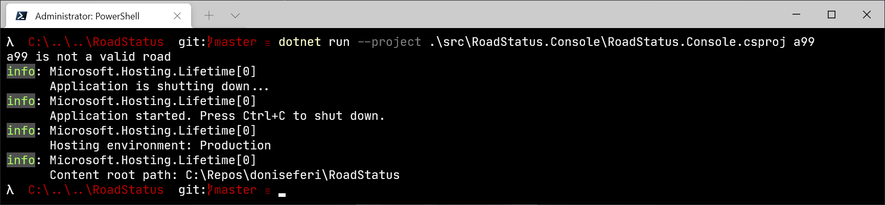
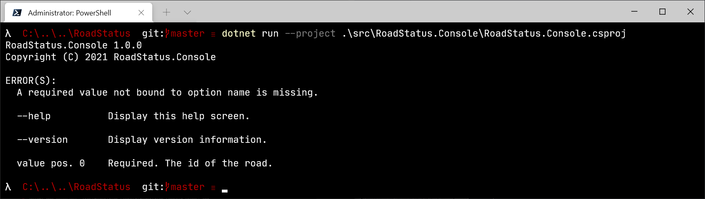
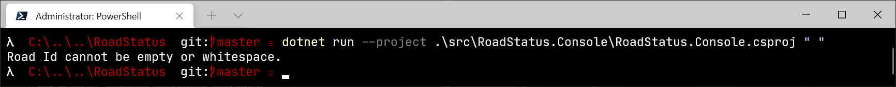
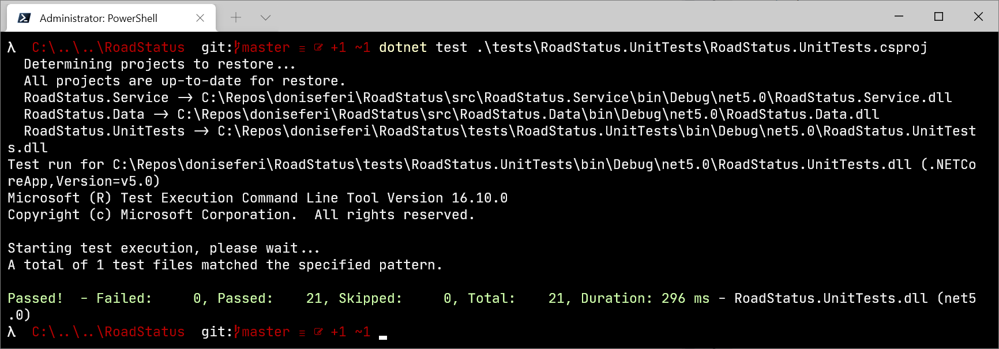
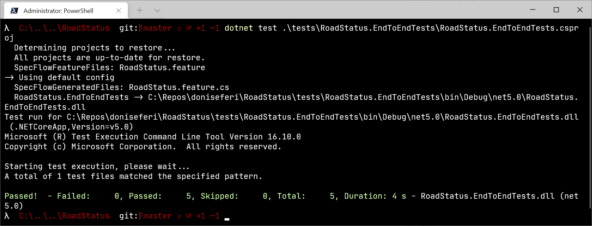
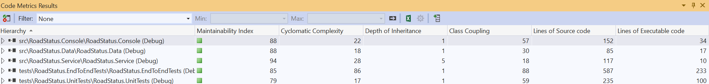

# Road Status

## What is Road Status
A console application that retrieves the status of any road that is managed by TfL (backed by their [Road](https://api.tfl.gov.uk/swagger/ui/index.html?url=/swagger/docs/v1#!/Road/Road_Get_0) endpoint).

## Prerequisites
- [.NET 5](https://dotnet.microsoft.com/download/dotnet/5.0)
- [App key](https://api-portal.tfl.gov.uk/)

All the commands detailed below are ran via [Powershell 7.1.5](https://github.com/PowerShell/PowerShell/releases/tag/v7.1.5).

## Building and running the application
Before running the tests you need an app key which has access to TfL's Road api. Once you have this you must configure the AppKey via a machine level environment variable or enter it into the appsettings.json file.

You can add the system level environment variable via system properties however the simplest way of setting the environment variable is via setx command as follows via powershell:
<code>setx TfLApiConfig__AppKey "YOUR_API_KEY" /M</code>

To remove this variable run (as admin):
<code>REG delete "HKLM\SYSTEM\CurrentControlSet\Control\Session Manager\Environment" /F /V TfLApiConfig__AppKey </code>

### Build the solution:
<code>dotnet build .\RoadStatus.sln</code>

### Run the solution:
<code>dotnet run --project .\src\RoadStatus.Console\RoadStatus.Console.csproj a1
</code> or <code>.\src\RoadStatus.Console\bin\Debug\net5.0\RoadStatus.Console.exe a1</code>

<code>dotnet run --project .\src\RoadStatus.Console\RoadStatus.Console.csproj a99
</code> or <code>.\src\RoadStatus.Console\bin\Debug\net5.0\RoadStatus.Console.exe a99</code>

<code>dotnet run --project .\src\RoadStatus.Console\RoadStatus.Console.csproj
</code> or <code>.\src\RoadStatus.Console\bin\Debug\net5.0\RoadStatus.Console.exe</code>

<code>dotnet run --project .\src\RoadStatus.Console\RoadStatus.Console.csproj " "
</code> or <code>.\src\RoadStatus.Console\bin\Debug\net5.0\RoadStatus.Console.exe " "</code>

## Running the tests
Before running the tests you need an app key which has access to TfL's Road api. Once you have this you must configure the AppKey via a secrets.json file as follows

Run the following commands while at the root of the repo:
<code>dotnet user-secrets init --project .\tests\RoadStatus.EndToEndTests\RoadStatus.EndToEndTests.csproj

dotnet user-secrets set "TfLApiConfig:AppKey" "YOUR_API_KEY" --project .\tests\RoadStatus.EndToEndTests\RoadStatus.EndToEndTests.csproj
</code>

You can confirm these have been set successfully via <code>dotnet user-secrets set "TfLApiConfig:AppKey" "faeb9e1b43214fde95500b1a7563170e" --project .\tests\RoadStatus.EndToEndTests\RoadStatus.EndToEndTests.csproj</code>

Using the .NET cli:
<code>dotnet test .\tests\RoadStatus.EndToEndTests\RoadStatus.EndToEndTests.csproj</code>

<code>dotnet test .\tests\RoadStatus.UnitTests\RoadStatus.UnitTests.csproj</code>

To remove user secrets run the following:
<code>dotnet user-secrets clear --project .\tests\RoadStatus.EndToEndTests\RoadStatus.EndToEndTests.csproj
</code>

The dotnet [user-secrets](https://github.com/aspnet/Configuration/commit/9518bec5b69e305315309a87213e0153cb26de7f) have been available since .net core 2.1.

## Code Metrics
